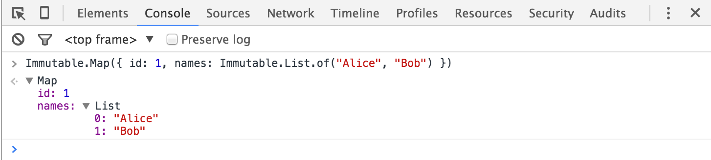

# Chrome Dev Tools for Immutable-js

The [Immutable](http://facebook.github.io/immutable-js/) library is fantastic, but inspecting immutable collections in Chrome's Dev Tools is awkward. You only see the internal data structure, not the logical contents. For example, when inspecting the contents of an Immutable List, you'd really like to see the items in the list.

The latest Canary version of Chrome (v48 as of writing) has support for custom "formatters". A formatter tells Chrome's Dev Tools how to display values in the Console, Scope list, etc. This means we can display Lists, Maps and other collections, in a much better way.

Essentially, it turns this:


into:



This library provides a formatter to do just that.

## Installation

Chrome v47+ (currently this is a Canary build)

In Dev Tools, press F1 to load the Settings. Scroll down to the Console section and tick "Enable custom formatters".

Then, in your project, install via npm:

```
npm install --save-dev immutable-devtools
```

And enable with:

```js
var Immutable = require("immutable");

var devTools = require("immutable-devtools");
devTools.install(Immutable);
```

Note: You probably only want this library for debug builds, so perhaps wrap with `if (DEBUG) {...}` or similar.

## Features

The library currently has formatters for: List, Map, Set, Record, OrderedMap & OrderedSet.

